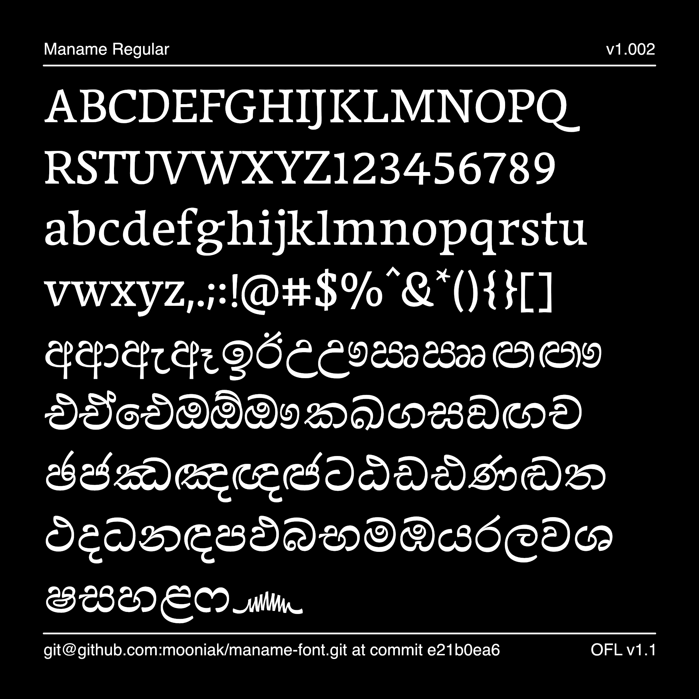

# Maname Font

Maname is a text typeface made for Sinhala script with quirky stroke modulation. Maname Latin is informed by the modulation of Sinhala companion and takes a versatlile lively forms.

Maname is a text typeface made for Sinhala script with quirky stroke modulation. Maname Latin is informed by the modulation of Sinhala companion and takes a versatlile lively forms.

This project was orignally conceptualised and prototyped by Pathum Egodawatta as a superfamily with many styles and scripts in partial fulfilment for the requirements for the Master of Arts in Typeface Design (MATD) at the University of Reading, Department of Typography and Graphic Communication in 2016. Since then a selected Latin and Sinhala componats from the academic project were extended to include support for wider Latin charachter set and full Sinhala support under the name Maname. 

To support onging development of this project please head to [Mooniak Patreon](https://www.patreon.com/mooniak) page. Or you can [tip Pathum](https://buymeacoffee.com/pathumego), so he can invest more resources into this project.

## Building

Fonts are built automatically by GitHub Actions - take a look in the "Actions" tab for the latest build.

If you want to build fonts manually on your own computer:

* `make build` will produce font files.
* `make test` will run [FontBakery](https://github.com/googlefonts/fontbakery)'s quality assurance tests.
* `make proof` will generate HTML proof files.

The proof files and QA tests are also available automatically via GitHub Actions - look at https://mooniak.github.io/maname-font.git.

## License

This Font Software is licensed under the SIL Open Font License, Version 1.1.
This license is available with a FAQ at
https://scripts.sil.org/OFL

## Repository Layout

This font repository structure is inspired by [Unified Font Repository v0.3](https://github.com/unified-font-repository/Unified-Font-Repository), modified for the Google Fonts workflow.
